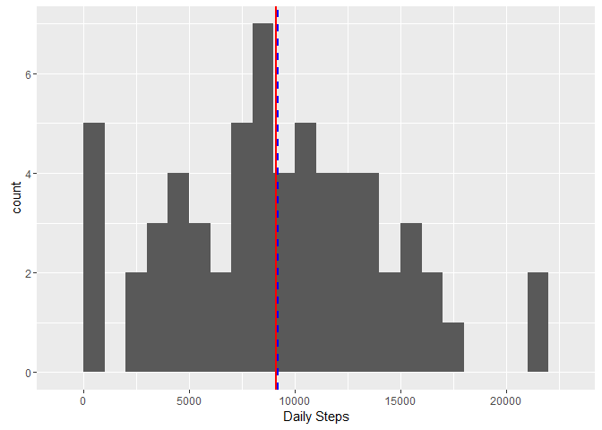
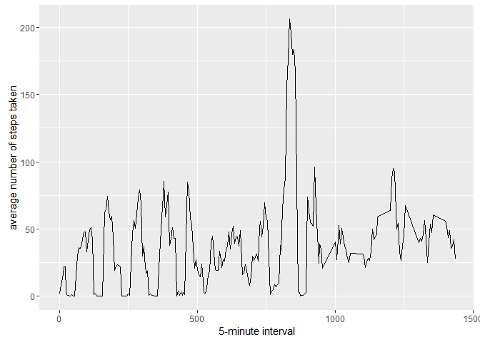
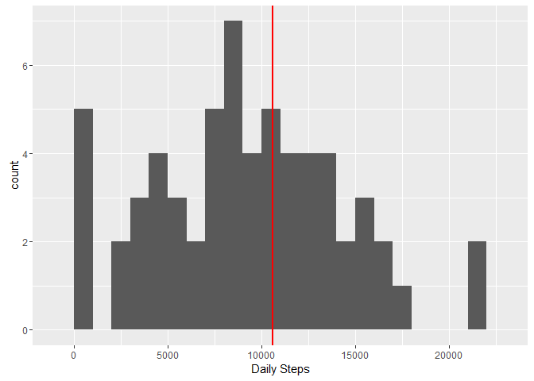
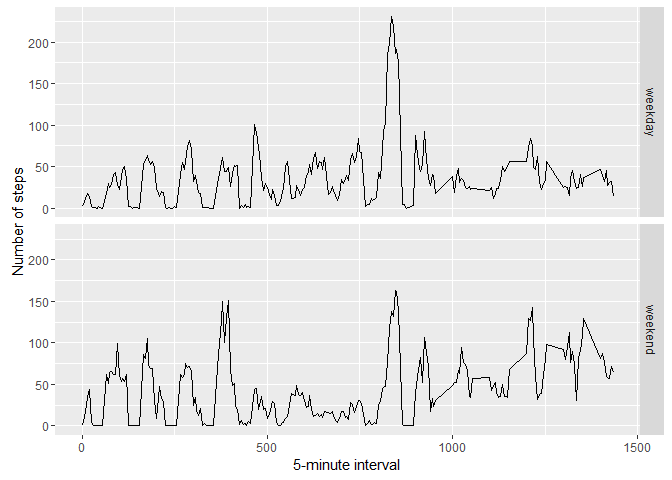

# Reproducible Research: Peer Assessment 1

## Loading and preprocessing the data
*To run the code contained herein, point your working directory to a folder containing the research data in zip format.*  
*Consult `getwd()` and `setwd()` for reference.*

The first step in our analysis is to load and perform any cleaning of the raw data. We start by loading the data from the provided zip.

```r
fileUrl <- "./activity.zip"
data <- read.csv(unz(fileUrl, "activity.csv"))
```
Now that the data has been loaded, we can extract and clean the data points we will need for our analysis. One of the first observations is that we find is that the 5-minute interval period often exceeds 1435.  This indicates that the interval has carried over into the next day and the date/interval should be adjusted.

```r
# Ensure the dates are saved as Date objects
data$date <- as.Date(data$date)

#Iterate over the elements and check if the interval has rolled over to the next day
for(i in 1:dim(data)[1]) {
  # The last interval period of the day is 1435 (23:55  or 11:55 PM)
  if (data[i,3] > 1435) { 
    data[i,2] = data[i,2] + 1
    data[i,3] = data[i,3] - 1435
  }
}
```

Once the data is cleaned, it is instructive to display several summary measures of the data to have a better understanding of the data.

```r
head(data)
```

```
##   steps       date interval
## 1    NA 2012-10-01        0
## 2    NA 2012-10-01        5
## 3    NA 2012-10-01       10
## 4    NA 2012-10-01       15
## 5    NA 2012-10-01       20
## 6    NA 2012-10-01       25
```


## What is mean total number of steps taken per day?
One of the questions we want to understand, on average how many steps does a person wearing an activity tracker take.  To answer this question we start by looking at a histogram of daily activity from the wearers.

```r
library(ggplot2)
total.daily <- tapply(data$steps, data$date, FUN=sum, na.rm=TRUE)
qplot(total.daily, binwidth=1000, xlab="Daily Steps") +
  geom_vline(aes(xintercept=mean(total.daily)), color="blue", linetype="dashed", size=1) +
  geom_vline(aes(xintercept=median(total.daily)), color="red", size=1) 
```



Included in the histogram are the mean (blue) and median (red) step counts from activity wearers.


```r
mean(total.daily, na.rm=TRUE)
```

```
## [1] 9203.355
```

```r
median(total.daily, na.rm=TRUE)
```

```
## [1] 9128
```

## What is the average daily activity pattern?
An other question we want to understand is when are the users most active during the day.  We can start to answer this question by examining activity levels across the day. Since the data consists of the step count on a 5-minute interval, we can plot a timeseries graph of these 5-minute intervals.

```r
library(ggplot2)
averages <- aggregate(x=list(steps=data$steps), by=list(interval=data$interval), FUN=mean, na.rm=TRUE)
ggplot(data=averages, aes(x=interval, y=steps)) +
    geom_line() +
    xlab("5-minute interval") +
    ylab("average number of steps taken")
```



From the graph it is clear the highest daily activity period is in the early afternoon, with the most active time being the interval 1:50 PM - 1:55 PM.

```r
averages[which.max(averages$steps),]
```

```
##     interval    steps
## 160      835 206.1698
```
## Imputing missing values
Thus far in our analysis we have excluded any incomplete measurements from our calculations.  This may present a certain level of bias in our calculations due to the number of missing entries.  To examine this further we should build an understanding of all incomplete entries.

```r
missing <- is.na(data$steps)
table(missing)
```

```
## missing
## FALSE  TRUE 
## 15264  2304
```
From the table above, we see that there are 2304 entries with missing step data.

We know that the wearer of the activity tracker had atleast the potential to take steps during these periods, so the minimum value we should see is 0 (NA implies that it was not possible for the user to move). There are several ways we can deal with these missing values.  We can either treat the all as 0 or we can use the mean step count for that interval.  For the purposes of this analysis we will assume the wearer was moving and use the mean step count for that interval.

```r
# Replace each missing value with the mean value of its 5-minute interval
imputed.value <- function(steps, interval) {
    imputed <- 0
    if (!is.na(steps))
        imputed <- c(steps)
    else
        imputed <- (averages[averages$interval==interval, "steps"])
    return(imputed)
}
imputed.data <- data
imputed.data$steps <- mapply(imputed.value, imputed.data$steps, imputed.data$interval)
```

Using the newly imputed data, we can see how the pattern of daily activity now looks.

```r
library(ggplot2)
imputed.daily <- tapply(imputed.data$steps, imputed.data$date, FUN=sum, na.rm=TRUE)
qplot(total.daily, binwidth=1000, xlab="Daily Steps") +
  geom_vline(aes(xintercept=mean(imputed.daily)), color="blue", linetype="dashed", size=1) +
  geom_vline(aes(xintercept=median(imputed.daily)), color="red", size=1) 
```



The newl revised data indicates that the wearers are more active!

```r
mean(imputed.daily, na.rm=TRUE)
```

```
## [1] 10592.54
```

```r
median(imputed.daily, na.rm=TRUE)
```

```
## [1] 10571.09
```
Our choice of estimation for the missing values has inherint bias towards greater activity levels.  This is because we assume that during periods of missing values, wearers are always active.  If we chose our other strategy of just using 0 for all missing values, we would have seen average activity levels drop (as expected).

## Are there differences in activity patterns between weekdays and weekends?
Our last question examines the difference between weekday and weekend activity levels.  Using our imputed dataset, we can plot the activity levels of weekends compared with weekdays. First we will create a data set that identifies weekends and weekdays.

```r
isWeekday <- function(date) {
    day <- weekdays(date)
    if (day %in% c("Monday", "Tuesday", "Wednesday", "Thursday", "Friday"))
        return("weekday")
    else if (day %in% c("Saturday", "Sunday"))
        return("weekend")
    else
        stop("invalid date")
}
imputed.data$date <- as.Date(imputed.data$date)
imputed.data$day <- sapply(imputed.data$date, FUN=isWeekday)
head(imputed.data)
```

```
##       steps       date interval     day
## 1  1.716981 2012-10-01        0 weekday
## 2  8.726415 2012-10-01        5 weekday
## 3 13.103774 2012-10-01       10 weekday
## 4 21.886792 2012-10-01       15 weekday
## 5 21.924528 2012-10-01       20 weekday
## 6  2.094340 2012-10-01       25 weekday
```

Now we are able to examin a plot of activity comparing weekdays to weekends.

```r
averages <- aggregate(steps ~ interval + day, data=imputed.data, mean)
ggplot(averages, aes(interval, steps)) + geom_line() + facet_grid(day ~ .) +
    xlab("5-minute interval") + ylab("Number of steps")
```



Based on the data visible in our plot, we can observe that activity levels are fairly similar for weekdays and weekends for activity tracker wearers.  The one difference we are able to observe is that wearers are more active in the early morning on weekends during the period roughly from 6:15 - 7:15am.  One possible explanation is that wears have more time to exercise in the morning on the weekends.
